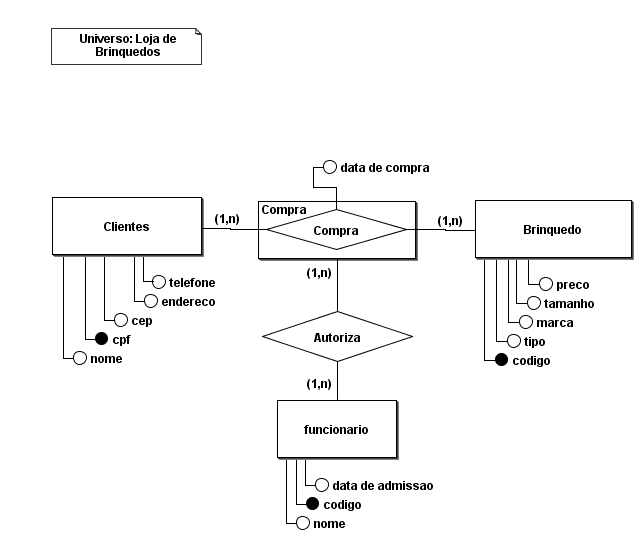
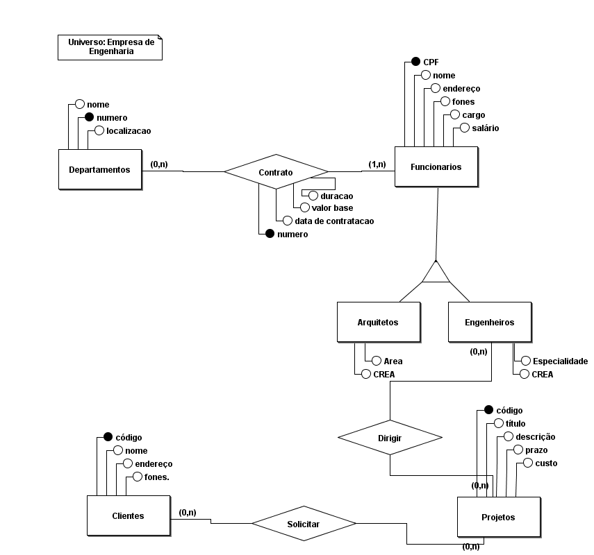
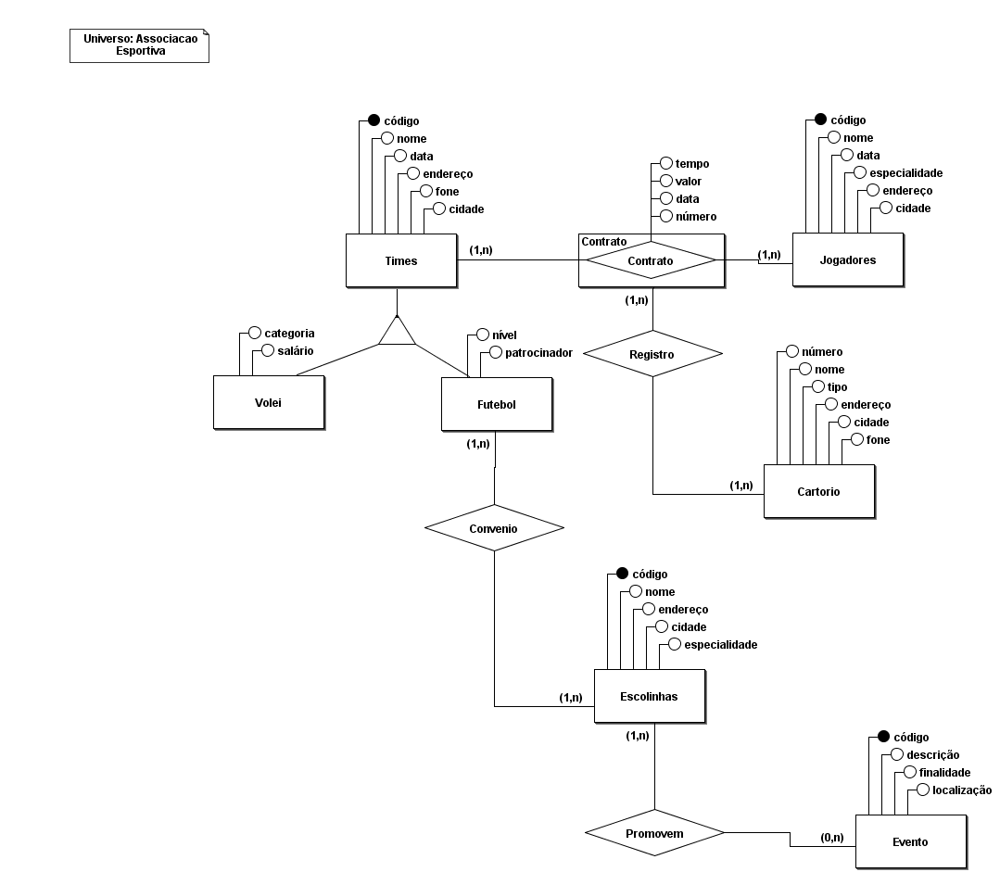
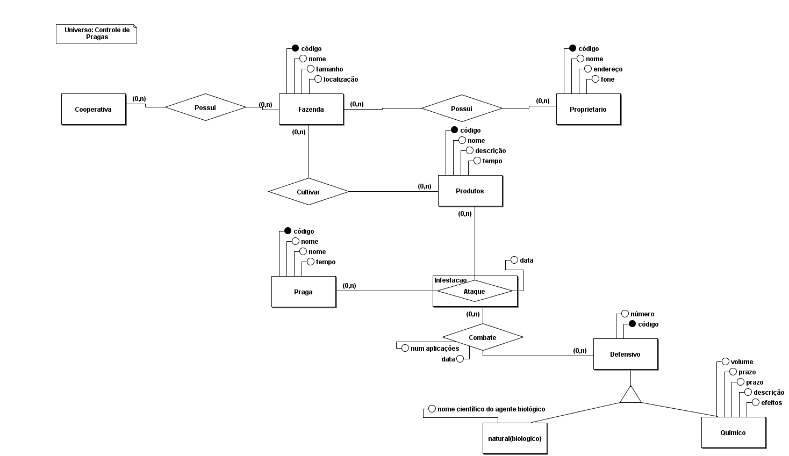

# Elabore o DE-R para as situações a seguir e entregue aqui a imagem de cada diagrama.

## 1) 

Os clientes de uma loja de brinquedos são cadastrados por nome, endereço, cep, telefone e CPF. Os brinquedos que eles compram estão identificadas por código, tipo, marca, tamanho e preço. É registrada a data de compra do brinquedo. A compra é autorizada por funcionários, que são contratados por nome, código e data de admissão. 

## DER:

</img>

## 2) 

Uma empresa de engenharia é dividida em departamentos que são cadastrados por um número, nome e localização. Os funcionários da empresa são contratados para trabalhar nos departamentos, portanto um contrato associa cada funcionário ao departamento onde ele trabalha e possui como atributos a data de contratação, o número, o valor base e a duração. 

Os funcionários são cadastrados por CPF, nome, endereço, fones, cargo e salário. Dentre os funcionários se destacam os engenheiros que possuem como atributos adicionais o CREA e a especialidade; Já os arquitetos possuem CREA e área. Os engenheiros são alocados para dirigir os projetos da firma a partir de determinada data. Os projetos possuem um código, título, descrição, prazo de entrega e custo. 

Os projetos são solicitados pelos clientes da firma que são cadastrados por um código, nome, endereço e fones. 

## DER:
</img>

## 3) 

Elabore um diagrama de entidade-relacionamento de uma associação esportiva, na qual os times são cadastrados por código, nome, data de fundação, endereço, fone e cidade. Esses times podem ser de Vôlei ou de Futebol, os de vôlei possuem como atributos categoria e salário base. Já os de futebol são armazenados o nível e patrocinador. 

Os jogadores desses times possuem como atributos código, nome, data de nascimento, especialidade, endereço e cidade. 

Um contrato faz a associação entre os times e seus jogadores, devem ser armazenados o número do contrato, a data, o valor base e o tempo de duração. Esses contratos devem ser registrados nos cartórios (número do cartório, nome, tipo, endereço, cidade e fone). 

Os times de futebol possuem convênios com escolinhas (código, nome, endereço, cidade, especialidade) e as escolinhas promovem em certas datas uma série de eventos (código, descrição, finalidade, localização). 
## DER:
</img>

## 4) Faça um DER para o controle de pragas das fazendas de uma cooperativa agrícola. 

A cooperativa é composta por uma série de fazendas cadastradas por código, nome, tamanho e localização. As fazendas são associadas aos seus proprietários, que apresentam um código, nome, endereço e fone. Além disso, as fazendas são associadas aos produtos que nelas são cultivados em determinadas épocas (mês/ano). Aos produtos são atribuídos um código, nome, descrição e tempo de vida. 
Um produto cultivado em uma fazenda pode sofrer o ataque de uma praga, e isso será detectado em uma determinada data. As pragas são cadastradas por um código, nome popular, nome científico e tempo de vida. 
Os ataques de pragas serão combatidos por um defensivo em certa data e com certo número de aplicações. Os defensivos apresentam um código, nome e podem ser de duas categorias: naturais (biológicos) ou químicos. Os defensivos químicos têm um volume, prazo de validade, prazo de contaminação, descrição dos componentes e efeitos colaterais; e os biológicos, nome científico do agente biológico. 
## DER:
</img>
